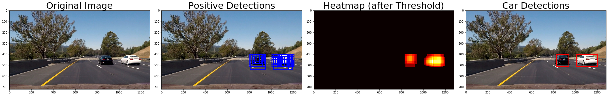

# **Vehicle Detection**

Project to detect vehicles in an video stream using a linear SVM classifier.

Full description of problem and task: [TASK.md](TASK.md)  
Source code: [Vehicle_Detection.ipynb](Vehicle_Detection.ipynb)  
Writeup: [WRITEUP.md](WRITEUP.md)  
Videos: [videos/](videos/)  

## Example Images of Vehicle Detection Pipeline:

## Demo gif showing the vehicle detection on the project video:  

